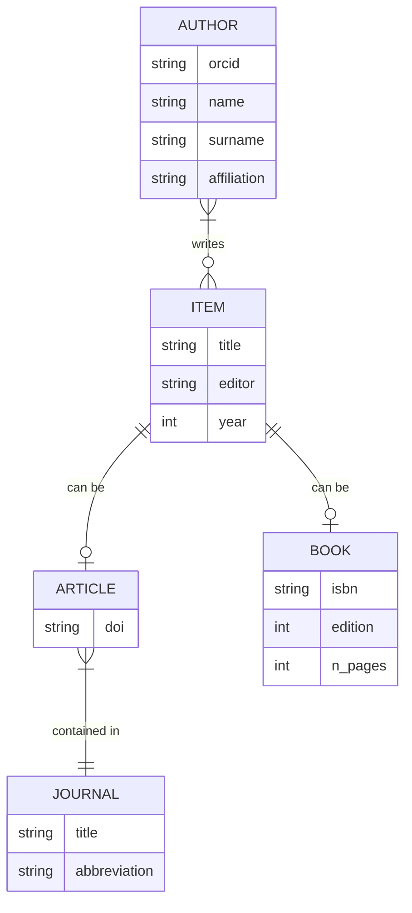
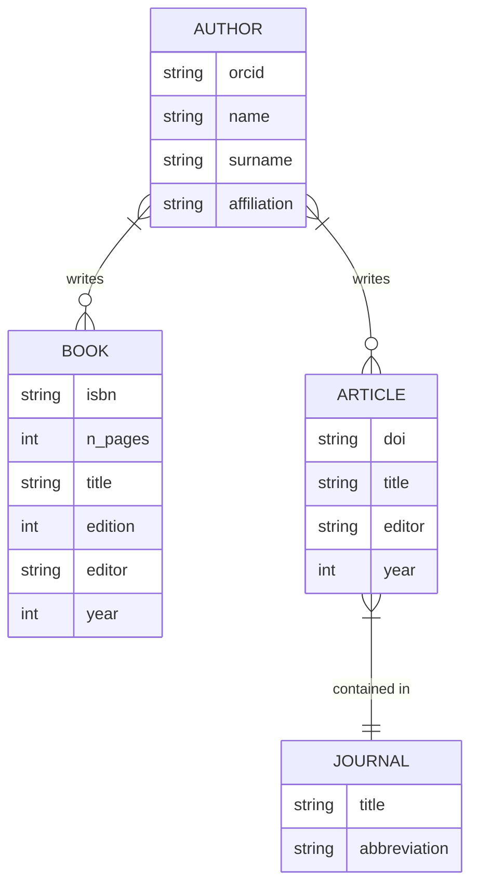

The **relational model** is a [[database]] data model focused on expressing relations within the data. A database that follows this model is called a **relational database** and a [[Database management system|DBMS]] that follows it is called a **relational DBMS** (**RDBMS**). It is almost synonymous with [[SQL]], which is the standard [[domain-specific language]] that is used to query a relational database.
## Limitations
The relational model doesn't work for everything: it does not work with composite [[data structure|data structures]] and it also does not support multiple values (arrays) per key.[^1] These kinds of data structures are however quite common in practice, so being able to store them in a relational database is still quite relevant. When it comes to arrays, there are options, depending on the kind of data you are working with.

One technique is to reduce the data into a scalar structure, typically a string. Since strings can contain just about anything,[^2] you can create an array-to-string encoding scheme to represent the data as a string when writing, then decode it with the inverse operation when reading. This has issues with lossless encoding/decoding (for instance, does the separation character in the encoding never appear in the data?), but more importantly, it makes it impossible to query the individual elements of the array, since they are reduced to a combined value. It is however a very flexible and rather easy solution.

Another method is to simply place some number of columns in the table to represent individual elements of the array. For example, you might have columns `author_1`, `author_2`, `author_3` and `author_4` in the array to represent the possible authors of a book. The issue here is that you are forcing an upper limit to the length of the array: any array with more elements than columns will have to be truncated. Moreover, any array with fewer elements will leave some cells empty, which leads to a waste of memory: those cells still need to be allocated for each row, but `author_4` is probably going to be empty 99% percent of the times. It's an inefficient use of space. This method only works well when you can reason about the data and think of a clear upper limit that doesn't lead to significant data loss. For example, you might have an array of phone numbers for each, say, student in a university. You can turn this into `phone_1` and `phone_2`, as realistically almost no student has three or more phone numbers and even if they do, you probably don't care about all of them: you just need one contact info and maybe a backup. This avoids the encoding/decoding step while keeping the table simple and representative of the data.
## Schema simplification
[[Schema|Schemas]] can grow complex fast in a relational database, so it is important to have reliable techniques to keep the complexity low to the extent that that is possible.

%%(TODO: Complete this section)%%

Consider this schema about a scientific article repository.

This kind of type schema could work well in an object-oriented language that allows subclassing: make an abstract class for `ITEM` and two concrete subclasses for `ARTICLE` and `BOOK`. In a relational DB, it can get quite complicated. Just think of all the relations necessary to support citations! The former schema can be squeezed by merging the `ITEM` table with the `BOOK` and `ARTICLE` tables.

[^1]: It is possible to make these work with special care, such as with PostgreSQL extensions like `pgarray`, but it is not a standard feature of the data model.

[^2]: In some cases, the length of the string might be limited. In modern SQL, the `TEXT` type is intended as dynamically sized and effectively unlimited (it's not, there's just a very large memory allocation that allows you to neglect character limits; this depends on the [[Database management system|DBMS]]), but it is possible to manually allocate a specific number $n$ of characters (`CHAR(n)`) or a maximum number (`VARCHAR(n)`).
