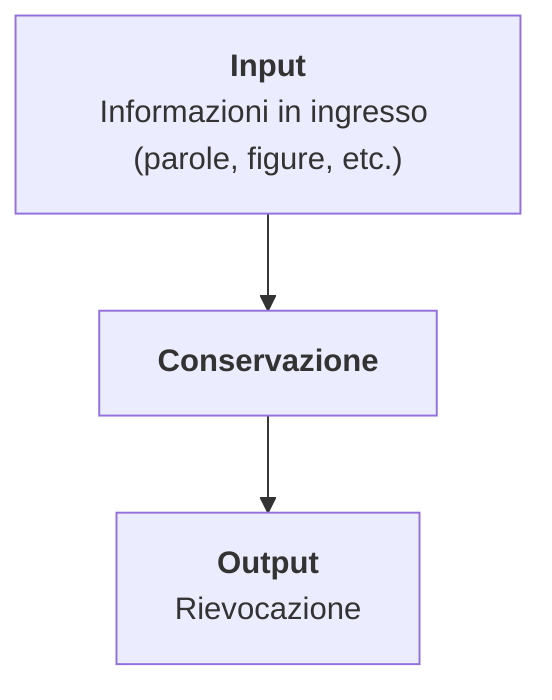
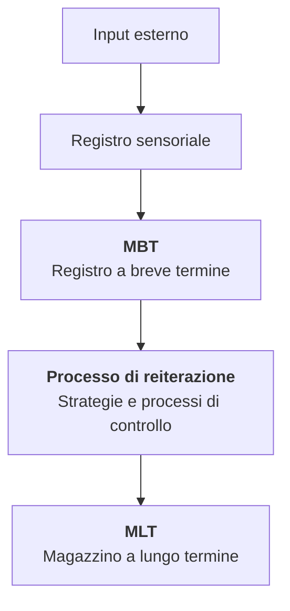

---
aliases:
  - HIP
---
La **teoria dell'elaborazione dell'informazione** (**human information processing** o **HIP**) è la branca della psicologia cognitiva che si occupa di studiare il passaggio delle informazioni attraverso il sistema cognitivo, inclusa la codifica e la decodifica delle informazioni.

I *comportamentisti*, un gruppo di psicologi, credevano che lo studio diretto dell'elaborazione fosse impossibile perché la mente è una scatola nera che non ha alcuna [[osservabile]]. Ciò che era possibile da studiare era il comportamento, e da lì ricondursi ai processi.

Gli studiosi di HIP si occupano di come il *bambino* elabora e trasforma l'informazione in ingresso.
### Processo fondamentale

Fra l'input è l'output avvengono le operazioni mentali e sono queste l'oggetto del nostro studio. L'informazione viene trasformata in qualche tipo di rappresentazione mentale interna, paragonata ??? :).

La mente umana ha dei limiti nella *quantità* di informazioni manipolabili e nella *velocità* con cui possono essere manipolate. Questi limiti differiscono da individuo ad individuo, per numerose ragioni, tra cui soprattutto l'eta: un bambino elabora informazioni in modo molto diverso da un anziano.

Un metodo utile per comprendere il funzionamento della mente e dell'elaborazione dei dati è lo studio degli errori commessi nell'elaborazione.
#### Modello modale di Atkinson e Shiffrin
Il modello di Atkinson e Shiffrin (1968) è un modello oggi superato ma piuttosto semplice per spiegare il processo di elaborazione dati.

